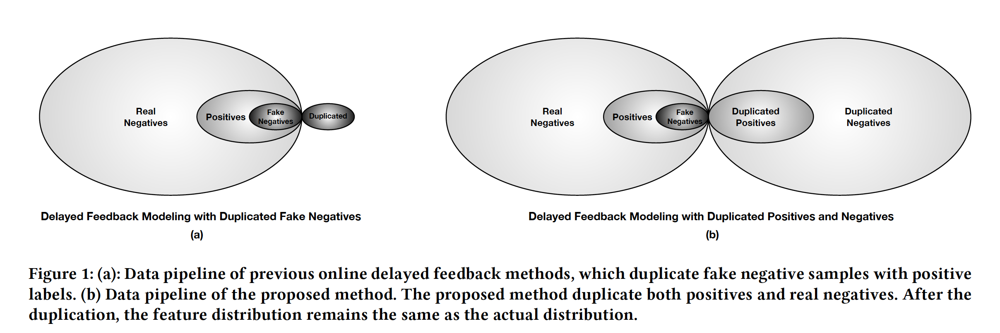
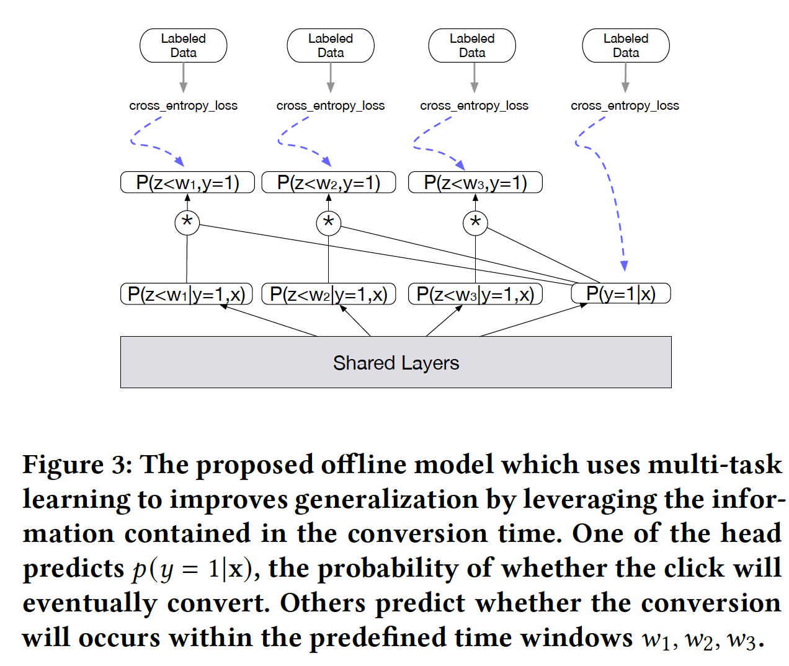
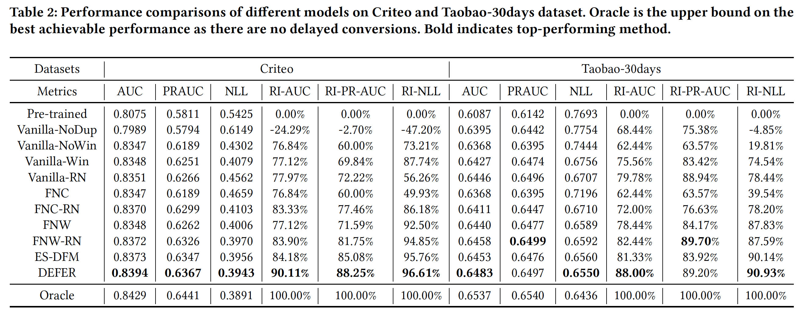
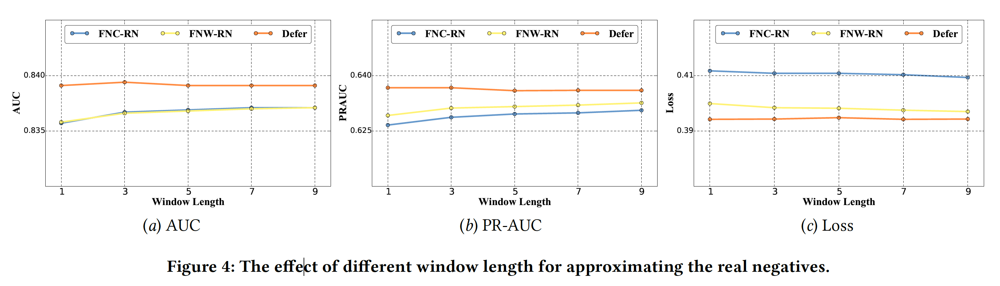

Real Negatives Matter: Continuous Training with Real Negatives for Delayed Feedback Modeling


本文介绍阿里巴巴展示广告的工作，基于延迟反馈的CVR模型的DEFER模型。 CVR 最大的问题就是延迟转化的问题， 这种延迟反馈对建模做出了一种挑战。 时效的数据对连续训练更有利，但是这些数据却缺乏Label的信息。 为了平衡数据的时效性以及label 的置信度，以前的工作大部分都是基于样本补偿机制，例如设置了一个等待窗口有或者完全不需要转化的信号，如果在等待的窗口之外发生了转化，这些样本就会重复并以正样本的形式再次插入训练数据流中。但是这些传统方法会引发一些问题，这些方法都是假定了观测的特征分布和真实的特征分布相同，但是重复插入的延迟正样本导致这样分布不同，并且由于正样本的稀疏，在转化的置信度上，延迟的正样本induce bias。为了修复分布的漂移，DEFER 使用了Imporance sampling 来加权loss。最终获得了CVR 的6% 的提升。


KeyWords： Delay Feedback, Continuous Learning, Display Advertising


## 背景和问题难点

展示广告涉及使用互联网作为获取网站流量和传递营销信息的主要营销方式。每转化成本(CPA)是展示广告中广泛使用的一种与转化有关的付费模式，其中广告商为预定义的转化出价(如购买和向购物车添加商品)。然后，系统根据预测的CVR将出价转换为曝光的价格(eCPM)。因此，准确估算CVR对于竞争激烈的广告系统至关重要。

在展示广告中，由于特殊事件、活跃广告主、广告活动和用户的变化，数据分布是动态变化的。为了跟上分布的变化，模型经常会不断更新以保持时效性。大多数工业系统采用连续训练（continuous training) 来预测点击率(CTR)和CVR, 训练管道在为样本分配标签之前等待一个时间窗口。如果点击或转换发生在窗口内，它将被标记为正样板，否则为负样本， 然后将样本输入到训练管道中。 

然而不同于CTR 预估， 展示广告的CVR 存在延迟反馈的问题。 转换动作可能在数小时或数天后发生。对于在训练时间附近点击的样本，由于转换等待时间太短，它可能被错误地标记为负。因此，虽然受益于实时训练，但较短的等待时间窗会引入假阴性，即错误标记的阴性样本，而较长的等待时间窗保持了准确性，但失去了新鲜度。




Challenge

1. 原始方法Fake Negative 样本被重复插入，导致观测数据的分布和真实分布不一致的问题
2. 当引入所有重复样本之后， 会导致
3. 


### 问题的形式化定义

在CVR 预测里面， 模型输入 $(x,y) \sim (X,Y)$, x 是一个特征，y 是一个转化的标签。CVR的预测的目标是学习一个函数参数$\theta$ 的函数$f$ 最小化经验平均误差。
$$
E_{(x,y) \sim (X,Y)}[\ell(x,y;f_\theta(x))]
$$
当转化发生时，一些样本被错误的标记为负样本，我们denote z 表示从点击到转化的时间，

- Real Negatives（窗口内外都是负样本）

- Fake Negatives（窗口外的正样本， label 取值是0）

- Positive 窗口内的正样本
- 重复的Fake Negatives 但是标签是1（窗口外正样本label 取值是1）


如果是直接把窗口外的正样本插入，会导致出现以上四种样本。


### Problem With  Fake Negative Weighted

FNW 的方法是基于fake Negative 进行加权,  并没有设置等待窗口，所有的样本立刻就被消费了，样本直接的被加上了negative 的标签。当数据产生反馈之后，正样本直接的加入模型。$p(x)$是真实的数据分布， $q(x)$是biased 的观测分布.

观测中的所有的负样本包括了真实的正样本，因此有
$$
q(x|y=0) = p(x)
$$
正样本在观测样本和真实观测的样本中都是相同的
$$
q(x|y=1) = p(x|y=1)
$$
由于重复样本了，因此样本的整体的数据量是$1 +  p(y=1)$
$$
q(y=0) = \frac{1}{1 + p(y=1)}
$$
从上述公式可以推导出
$$
q(y=0|x) = \frac{1}{1 + p(y=1|x)} \\
q(y=1|x) = \frac{p(y=1|x)}{1 + p(y=1|x)}
$$


FNW 假设 $p(x) = q(x)$
$$
\begin{aligned}
L &= E_{(x,y) \sim p} \ell(x,y; f_\theta(x)) \\
&= \iint p(x,y) \ell(x,y; f_\theta(x))  dxdy \\
&= \iint p(x) q(y|x) \frac{p(y|x)}{q(y|x)} \ell(x,y; f_\theta(x))  dxdy \\
&\approx \iint q(x) q(y|x) \frac{p(y|x)}{q(y|x)} \ell(x,y; f_\theta(x))  dxdy \\
&= E_{(x,y) \sim q} \frac{p(y|x)}{q(y|x)} \ell(x,y; f_\theta(x))
\end{aligned}
$$


因此上述的公式可以变形为
$$
\begin{aligned}
L &= E_{(x,y) \sim q} \frac{p(y|x)}{q(y|x)} \ell(x,y; f_\theta(x)) \\
&= \sum_{x,y} \frac{p(y|x)}{q(y|x)} \ell(x,y; f_\theta(x)) \\
&= - \sum_{x,y=1} \frac{p(y=1|x)}{q(y=1|x)} ylogf_\theta(x)  +  \sum_{x,y=0} \frac{p(y=0|x)}{q(y=0|x)} (1-y)log(1- f_\theta(x)) \\
&= - \sum_{x,y=1} (1 + p(y=1|x)) ylogf_\theta(x)  +  \sum_{x,y=0} p(y=0|x) (1+ p(y=1|x)) (1-y)log(1- f_\theta(x)) \\
&= - \sum_{x,y=1} (1 + p(y=1|x)) ylogf_\theta(x)  +  \sum_{x,y=0} (1-p(y=1|x)) (1+ p(y=1|x)) (1-y)log(1- f_\theta(x)) \\

&= - \sum_{x} y(1 + p(y=1|x)) logf_\theta(x)  + (1-y) (1-p(y=1|x)) (1+ p(y=1|x)) log(1- f_\theta(x)) \\


\end{aligned}
$$


将整体的公式简化成为了基于估计分布 p(y=1|x) 的函数形式。FNW 使用模型进行估计这个类似弹性分的参数。

观测的分布q 不是更好学习吗？ 为什么要学习真实的分布p， p 和q 都是真实分布， 一个是真实的

intuitive 上理解 就是补偿机制是固定的模式，但是打乱了正常的分布， 这个真实的分布怎么学习？ 有经验分布存在吗？ 怎么做loss bp


### Problem with Fake Negative Calibration

FNC 基于q 直接的学习一个函数，并使用这个函数进行纠偏， 那么这个q 怎么学习出来无偏了？

directly estimates biased distribution q
$$
p(y=1|x) = \frac{q(y=1|x)}{1- q(y=1|x)}
$$
这么看FNC 比FNW 更加靠谱，FNW 的训练数据需要剔除补偿样本的旧样本重新模型训练。

**那么每次一个窗口加入加入正样本，就剔除那个之前加入的负样本进行一轮训练不就解决问题了**

但是不能增量训练，增量训练负样本已经在模型中了。只能从FNC


## 解决方案

### 数据流

之前的解决方法直接把fake negative 直接加入进训练，打乱了数据的分布。因此我们在加入延迟的重复的正样本的时候，也同时重复加入真负样本来平衡数据的分布。

所以这个假设 $q(x) \approx p(x)$ 会引入额外的bias

除此之外，cvr的置信信息只能来自稀疏的正样本，

One strategy to set the sample-specific window is to define

multiple window length and train a multi-class classification model


对于样本可以设置一个等待窗口， 这个等待窗口可以对每个样本设置一个。 设置sample-specific window 的原因是每个产品有不同的延迟属性。例如贵的商品比便宜的商品有更长的转化周期。

一种策略是定义一个窗口，并训练一个模型进行预测。
$$
w_1 = \arg max_w p_{waitting}(w|x) 
$$


在此窗口中具有转换的样本被标记为阳性样本，没有转换的样本被标记为假阴性或真阴性。对于那些假否定，如果转换发生在归因窗口的后面，我们将把这个带有积极标签的样本摄取到管道中。对于那些最终没有发生转换的真实负面，我们也将复制并摄取它们到培训管道中。重复给转换信号带来了更多的确定性信息。因此，所提出的方法中有四种样本，真实阴性，阳性，假阴性和带有真实标签的重复样本(可以是阳性或阴性)


### 损失函数

由于把重复样本加入，包括重复的正样本和负样本因此有 $q(x) = p(x)$

并且有
$$
q(y=0|x) = \frac{q(x,y=0)}{q(x)}
$$


### Real Negatives 的部署设置

在展示广告中，不同的业务场景往往会根据不同的用户行为设置不同的归因窗口。例如，在阿里巴巴，有的业务场景设置1天为归因窗口，有的业务场景设置7天为归因窗口。值得注意的是，实负样本的延迟时间等于正样本的最大延迟时间


As such, we approximate

the real negatives by setting a shorter window 𝑤3 (𝑤1 < 𝑤3 < 𝑤2)

for scenarios with long conversion window


### 离线训练的方式

the proposed offline approach uses multitask

learning to improves generalization by leveraging the information

contained in the conversion time. Concretely, the model has

𝑁 + 1 heads on top of the shared bottom layers. One of the head

predicts the probability of whether the click will eventually convert




这个z 和y 的联合分布指的是啥？
$$
p(z < w_n ,y=1|x) = p(z < w_n |y=1, x) * p(y=1|x)
$$

$$
\begin{aligned}
L &= -\sum_n\sum_x y_n log p(z<w_n, y=1|x) \\
&= -\sum_x y log p(y=1|x) - \sum_x(1-y) log (1-p(y=1|x))
\end{aligned}
$$


## 效果评估

### 评估指标 

AUC

PR-AUC

​	area under precision-recall curve， 相比auc ，当负例超过正例会更敏感

NLL

​	Negative log likehood， 对预测的绝对数值比较敏感

RI-AUC
$$
\frac{AUC_{Defer} - AUC_{Pre-trained}}{AUC_{Oracle} - AUC_{Pre-trained}} * 100\%
$$


Oracle: The oracle can access the true label, i.e., it can look into the future to determine if there will be a conversion. This is the upper bound on the best achievable performance as there are no delayed conversions for oracle.


### 实验效果和效果分析

Compared Methods

Pre-trained

FNW

FNC

ES-DFM





#### 基本结论解释


#### 消融分析



短窗口会降低数据cache 的缓存时间，但是也引入了更多的fake Negatives，因此比较了不同的窗口$z_3$ 的影响和敏感性。根据结果看，3天的窗口，FNW 等就可以得到最好的效果。

同时可以发现评估指标在3天之后是很稳定的，所以我们可以通过相对短的窗口去近似判断real Negatives

当数据被立刻feed 到模型里面时候，模型就可以保持新鲜性，但是重复样本可以帮助降低观测分布的bias可以降低未置信读。 真实的Negatives 在长窗口下帮助提升很小，但是消耗更多的资源，因此我们可以在实际中选择一个合适的窗口。


### 实现细节


离线特征直接embedding，数值特征直接bucket 之后，一起feed into 网络

离散特征要8维度，没有打平吗？

We implement the CVR model as a

deep neural network. The features are transformed to embedding

vectors firstly and then fed to fully-connected layers


The hidden units are fixed for all models with hidden size {256, 256, 128}. The

activation functions are Leaky ReLU [15]. For each hidden layer, we

also apply batch normalization [9] to accelerate the model training.

All methods are trained with Adam [11] for optimization. Following

ES-DFM [24], the waiting window 𝑧1 is set as 0.25 hour. 


```
# 数据处理


# 模型建模
def __init__(self, name, params):
        super(MLP, self).__init__()
        self.model_name = name
        self.params = params
        num_features = [feature_column.bucketized_column(
            feature_column.numeric_column(str(i)),
            boundaries=[j*1.0/(num_bin_size[i]-1) for j in range(num_bin_size[i]-1)])
            for i in range(8)]
        if name == "MLP_FSIW":
            num_features.append(feature_column.numeric_column("elapse"))
        cate_features = [feature_column.embedding_column(
            feature_column.categorical_column_with_hash_bucket(
                str(i), hash_bucket_size=cate_bin_size[i-8]),
            dimension=8) for i in range(8, 17)]

        all_features = num_features + cate_features

        self.feature_layer = tf.keras.layers.DenseFeatures(all_features)
        
        x = self.feature_layer(x)
        x = self.fc1(x)
        x = self.bn1(x, training=training)
        x = self.fc2(x)
        if self.model_name == "MLP_wintime_sep":
            x1 = self.bn21(x, training=training)
            x1 = self.fc31(x1)
            x1 = self.bn31(x1, training=training)
            x1 = self.fc41(x1)

            x2 = self.bn22(x, training=training)
            x2 = self.fc32(x2)
            x2 = self.bn32(x2, training=training)
            x2 = self.fc42(x2)

            x = tf.concat([x1,x2], axis=1)
        else:
            x = self.bn2(x, training=training)
            x = self.fc3(x)
            x = self.bn3(x, training=training)
            x = self.fc4(x)
```


### 部署

#### Online Serving With Continuous Training

评估了在二个场景上使用连续训练部署在展示广告上的一个多任务方法。 CVR 模型目标是预估加购的概率，这个转化的时间窗口是1天。在A/B 实验测试中， CVR 有8.5% 的 提升


#### Online Serving with Offline Training

评估了在一个场景上使用离线训练部署在展示广告上的一个多任务方法。 CVR 的预测目标是预测购物的概率，购物的常规的收货期是7天。 模型在30天的数据上训练，并预测接下来的日期的数据， 模型对比基础模型有一定的提升，在A/B实验的测试中，有6% 左右的CVR 提升。


## 结论和总结

在这篇论文中深入探究了延迟反馈建模的问题，比起以前的方法，DEFER 消费重复的real negatives数据并且米有改变原始的数据分布。  消费重复real neg


在本文中，我们研究了在线延迟反馈建模问题。与以前的方法相比，所提出的defer方法在不改变原始特征分布的情况下摄取了真实阴性。摄取重复的真实底片提供了更多的标签正确性，促进了延迟反馈的建模。随着实际负极的摄取，进一步采用重要性抽样来纠正分布偏移。除了提出的在线CVR预测方法外，我们还分享了我们在不同转换归因机制和预算的商业平台上的部署经验。在工业数据集上的实验结果验证了所提方法的优越性。到目前为止，所提出的方法已经成功地部署在阿里巴巴的展示广告系统中。在我们的部署中获得的实践经验可以推广到其他设置，因此研究人员和工业从业者都感兴趣。


