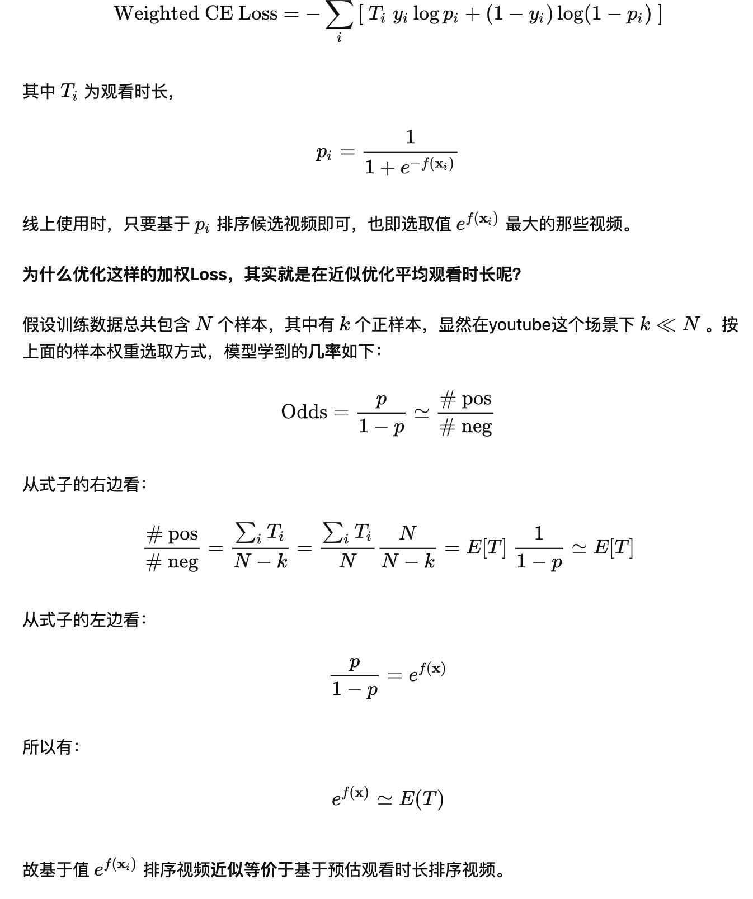
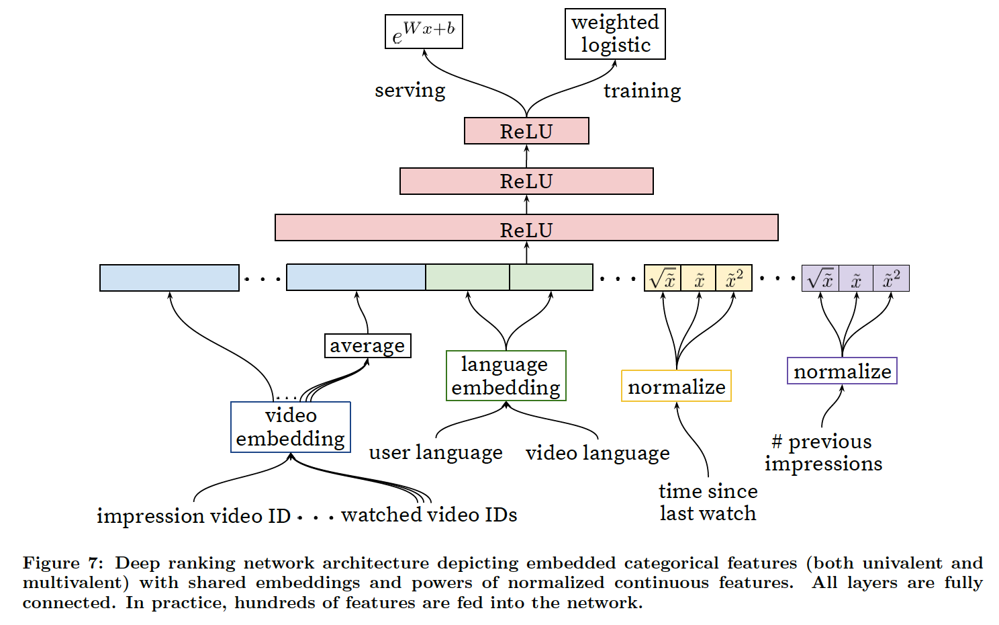

Deep Neural Networks for YouTuBe Recommendation

本次阅读的是2016年YouTube 的推荐系统的论文，关于如何使用神经网络进行推荐系统建模的解决方案。本文从神经网络对推荐模型效果的提升角度上进行介绍，描述了一个深度排序模型，并给出了一些对大规模深度学习推荐系统的一些实践的想法。

关键词： Recommender system，deep learning， scalability

## 1. 背景&问题难点

YouTuBe 是世界上最大的视频网站之一， 用户在网站上创作，分享和观看视频。YouTube 的推荐系统帮助用户从海量的视频中个性化的推荐内容。  大规模视频网站的推荐系统有以下的难点

1. 大规模（scale）

   很多推荐系统的方法都只是在小规模的问题上能有效果，但是在面临大规模的数据，大规模的用户下，推荐系统模型需要更加有效的分布式学习方法。

2. 时效性（Freshness）

   YouTube 每秒都有大量的视频上传，因此大规模的推荐系统需要实时的理解新视频，以及用户的最新的动作。平衡新视频和旧视频的推荐类似于探索和利用的角度。

3. 噪声性（Noise）

   由于稀缺性和各种不可观察的外部因素，YouTube上的历史用户行为本质上是难以预测的。 我们很少得到用户满意的真实值，而是对有噪声的隐式的反馈信号进行建模，此外和内容的数据结构很杂乱，模型的算法需要去对这些训练数据有良好的robust。

同时需要和Google 的产品线保持同样的技术架构，系统搭建于Google Brain上，使用有良好Tensorflow 基建的神经网络来搭建推荐系统。

后面从几个方便进行介绍

1. 首先介绍总体的系统方案，然后介绍了候选集产生系统方案，以及其如何训练和serve。 候选集部分的实验结果证明了其模型收益于隐藏层以及**额外的异质信号**。
2. 排序模型方面，介绍了经典的逻辑回归如何应用于预测平均观看时间，而不是点击概率。实验结果也证明了深度层的收益。


## 2. 解决方案

### 2.1 系统介绍

系统由两部分组成， candidate generation 以及ranking 系统，需要两部分模型。


Candidate Generation Network 

​	候选产生模块以用户的历史视频交互序列为输入，**并从海量的候选视频中产生一个几百的候选集 **。 基于协同过滤的思路，捕捉用户之间的相似性，只提供宽泛的（broad）的个性化， 用户之间的相似性被表征为一系列特征比如看视频的ID，搜索词等等。 候选集召回被定义为一个分类的问题。 （with high precision）

Ranking Network

​	精排模型以上述的输入百量级视频进行精细的排序，进一步捕捉候选集和用户的精细化的联系，保持较高的召回recall。精排网络使用**海量丰富的特征训练之后给每个视频分配不同的分数，**最高的分数的视频被排序之后呈现给用户。 被定义为一个二分类的问题，同时观看时间被定为回归的问题。（with high recall）

offline evaluation & online A/B

​	使用一些离线的指标来引导迭代的提升（use of offline metrics to guide iterative improvements)。实际模型的决策采用是A/B 的线上实验来作为验证。用这些线上环境可以检测到用户测指标深层的变化包括点击率，观看时间等。 线上的A/B 很重要，**因为离线结果不一定和线上结果相关联**（live A/B results are not always correlated with offline experiments)。


### 2.2 候选集模型

Canditate Generation 

通过候选集产生的模块， 大量的候选集视频被筛选为几百个视频， 这里的候选集模型的方法就是一个在rank loss （矩阵秩loss） 上训练的矩阵分解方法。以NN的的方式来产生Embedding 向量的矩阵分解的方法。 从这个角度，候选集召回的方法可以被当做矩阵分解的非线性泛化（non-linear generalization of factorization tech)

基于神经网络做泛化矩阵分解的好处就是可以把连续和离散特征都加入模型之中，将基于关键词的的search history 和 基于视频id的watch history 的基于词袋模型处理成离线的Embedding， 并输入了包括地理位置embedding、用户人口统计特征等等。人口统计特征对于提供先验信息非常重要，以便新用户能够合理地使用推荐。用户的地理区域和设备被嵌入并连接起来。包括简单的二进制和连续特征，如用户的性别、登录状态和年龄，直接作为归一化的实值输入到网络中 。


召回模型的整体结构为：

1.  输入层是用户观看视频序列的embedding mean pooling、搜索词的embedding mean pooling、地理位置embedding、用户特征；
2.  输入层给到三层激活函数位ReLU的全连接层，然后得到用户向量；
3.  最后，经过softmax层，得到每个视频的观看概率。


#### 候选集推荐问题当做分类问题

把推荐问题当做一个多分类的问题， 建模的为时间t 下用户u在环境c 下的观测一个v 视频的概率。 在这种建模下，用户的嵌入矩阵实际上就是从稀疏的包括个体视频，人口统计信息下向量映射到另外一个N空间下的表示。模型这里的最后的输出就是一个U 的嵌入的向量。虽然YouTube 有很多种显示的反馈机制，比如点赞收藏，但是我们还是用的隐式的用户观看视频作为模型训练信号，完成作为正样本。
$$
p(w_t=i|U,C) = \frac{e^{v_iu}}{\sum_{j\in V}e^{v_iu}}
$$
Efficient Extreme Muliticlass

这里的视频类别极其的大，所以需要进行优化，这里采用使用负采样的方式进行训练。一次实际的loss 为正样本标签和采样的负样本，对比传统的softmax 上，这样会加速100倍。 另外一种方式是hierarchical softmax，但是效果对比负采样效果很差。 

在线上Serving 的时候，选择最大的几个来呈现给用户。但是由于在几十毫秒的严格服务延迟下对数百万个项目进行评分，需要在类的数量上采用近似的次线性评分方案， 对这个U 向量，快速近似计算领域最大的top。 快速搜索方法ANN 后面可以了解一下。


**视频新鲜度特征**

视频有明显的生命周期，例如刚上传时比之后更受欢迎，所以视频流行度随着时间的分布是高度**非稳态**的（下图中的绿色曲线）。因为模型是基于历史数据训练获得的，所以它对每个视频的预测会倾向于拟合此视频在训练数据中的平均观看情况（下图中的蓝色曲线）。 线上Serving的时候把这个特征设置为0, 表明模型做出预测的时候是不依赖这个时间的。 如果剔除这个feature， 整体的预测的概率就和upload 无关了。


#### 标签和内容选择

surrogate  learning problem 

训练的样本不仅仅包括我们推荐结果下的视频，还有很多其他嵌入网站浏览的YouTuBe视频。否则会导致新视频很难得到展示，因为推荐训练本身的样本是推荐的结果，造成了这种缺乏探索的偏差。 另一种洞察提升实时指标的方式是采用对每个用户截取固定长度的样本，有效的在loss 上降低用户样本的样本数量的影响。 对高活跃用户贡献的样本对模型降低影响。

Youtube发现用户一开始都会范围比较广地浏览各种视频，然后再专注于一个比较小的范围内。（应该是从探索到发现喜爱），这是一种不对称的浏览行为，所以，相对于从**观看序列中随机抽取一个作为label**（下图a），即忽略这种不对称性又缺失未来的信息。 

剧集通常是按顺序观看的，用户通常会从最受欢迎的类型开始发现艺术家，然后再关注较小的利基市场。因此，我们发现预测用户下一个手表的性能比预测随机拿出的手表要好得多(图5)。许多collaborativeltering系统通过拿出一个随机项目并从用户历史记录中的项目中预测它来隐式地选择标签和上下文(5a)。这会泄露未来的信息


#### 负采样

上面也提到：召回网络的目标即可以理解为预测对于一个用户，在当前的上下文场景下，观看每个视频的概率。

那么，对于每个样本来说，所有视频都可能是正样本。假如有100W个视频，那么召回模型就变成一个100W分类模型了，这显然带来了很大的训练难度。

所以，就需要用到负采样了，论文这里讲得比较模糊，大概思路就是：

-  把100W分类调整为K级别的分类；
-  正样本如上述方法提取，负样本则从视频库中根据重要性抽样；
- 这里分享下个人的拙见：本人也负责过召回模型的研发，一开始为了方便排序模型的处理，就从曝光未点击的样本进行负采样，作为召回模型和排序模型的负样本。离线训练时，召回模型的指标都还挺好，但上线之后，发现推荐与用户画像根本搭不上边。**所以，召回模型的负采样必须要包含从全量item抽取的部分（easy negative samples），但一般还需要包括另外一部分hard negative samples。**
- **为什么呢？主要是为了与真实场景统一，很好理解，真实的召回场景本来就是从全量item库中进行推荐，而不是从小部分item（如曝光非点击的item）。并且曝光的item是由上一个版本的召回模型决定，会导致长尾效应，推荐越来越“窄”；**
- **另外，hard negative samples是为了在召回模型大方向正确的前提下，能够增加模型的训练难度，增强个性化推荐能力。一般会使用推荐流曝光位置靠中的未点击item。**


### 2.3 排序模型

Ranking 排序模型的主要功能就是利用曝光信息去针对实际的用户界面去个性化和精细校准候选预测。例如一个用户可能会看一个视频，但是因为这个视频

在精排阶段我们有很多的特征去描述视频和用户对于视频的兴趣，因为候选集也只有百左右。

精排对于集成不同维度不可比较的候选来源也是非常重要的

使用一个类似上述候选集模型的网络结构使用logistic 去打分

最后的排序目标是一个基于A/B 线上结果调优出来的一个简单的视频观看时间。

通过点击率排序常常会促进欺骗性视频，观看时间建模则会优化这个问题。

#### 1. 特征工程

Feature Engineering

排序模型使用了几百个特征，包括了类别和数值。 尽管深度学习理论上可以降低手工特征工程的负担， 但是原始自然的数据并不能直接输入模型。我们依然还是需要花费工程资源去转换用户和视频的特征变成有用的特征。主要的挑战就是表示用户动作的行为序列以及这些特征和视频曝光之间的联系如何打分。

观测到最重要的信号就是描述用户历史交互和视频本身以及其他相似的视频。 考虑用户user 在在topic， channel，以及videos之间的关系。 

例如考虑用户历史

用户实际从这个频道中观看了多少视频，用户最后一次观看这个topic 视频是什么时间

这些连续的特征描述用户在相关视频上的最后一次的表现非常有效

我们也

描述历史视频曝光频次特征也是对于推荐留存指标很重要的，如果一个用户经常被推荐一个视频但是不点击，就需要在下一个page load 中减少相应的曝光。 提供即使的响应和观看历史也是一个很有帮助的事情。


#### 2. 类别特征的Embedding

类似于候选集产生的模式，我们使用嵌入向量去将稀疏的类别特征转化为适合网络结构的连续特征。每个单独的ID都有一个独立的的学习空间，维度取决于数值的词汇大小。 这些词汇表就是做简单的查询


#### 3. 数值特征的规范化

网络结构对输入的分布十分的敏感，然而其他的方法比如集成树对特征具有缩放不变性(invariant to scaling of features)。 实践中发现连续特征的合适的规范化对收敛性有关键的影响。 对连续特征使用累计分布变换到[0,1) 区间的特征工程方式。 这种积分变换用于在训练开始时的数据计算分位数，然后根据特征的分位数进行线上插值的方式来进行积分。

```
This integral is approximated with linear interpolation on
the quantiles of the feature values computed in a single pass
over the data before training begins
```


网络除了输入原始的特征之外，还输入了一些数学计算类特征，比如平方和开方，给网络结构更加强大的表现能力。 输入连续数值的平方类型特征发现对于离线准确率有一定的提升。


#### 4. 建模期望观测时间

Modeling Expected Watch Time

我们的目标是根据训练样本去预估观看时间，但是样本本身是正样本的点击或者负样本的不被点击。正样本被标注了视频被观看的时间。 为了预估观看时间，我们使用了加权逻辑回归(weighted logistic regression)

点击率模型本身是采用交叉熵的逻辑回归的方式，但是正样本上被施加了观看时间作为加权， 负样本是统一的单位。 通过这种方式，实际学习的是一个观看时间加权的点击概率。 例如当正样本的比例很小时， 那么实际的公式近似于另外一种形式E(T)(1+P), P 为点击率，如果P很小，近似学习的就是平均观看时间。
$$
Odds = \frac{\sum{T_i}}{N-k} \sim E[T] (1+P) \sim E[T]
$$



实际上使用指数函数作为最后的激活函数去产生这个公式，近似预估观看时间。




### 隐藏层的实验

Experiment with Hidden Layers

对网络的结构层进行的不同配置的比较，评测指标采用weighted per-user loss 这种形式，具体定义为，如果一个负样本打分比正样本打分更高，就认为这个观看时间是一个错误观看时间（mispredicted watch time)

Weighted，Per user loss 就是错误观看时间在整体观看时间pairs 上的比例, 实际上也就是加权AUC。

这些结果表明，增加隐藏层的宽度可以改善结果，增加隐藏层的深度也是如此。然而，代价推理所需的服务器CPU时间。1024宽的ReLU, 512宽的ReLU, 256宽的ReLU的配置了我们最好的结果，同时使我们保持在我们的服务cpu预算之内。 对于正负样本给以同样权重的方式，结果上看loss 增加了4.1%。

> 这里有点假，评测指标就是倾向于加权的评测，同权肯定loss 效果差啊。


## 总结

本文描述了一个基于两段式模型来解决推荐视频问题的方案， 候选集产出模型和排序模型。 候选集产出模型的深度协同过滤模型更有效的和各种信息融合，表现的性能优于旧基线矩阵分解的方式。 发现对于观测序列采用最后一个作为预测，可以捕捉不对称行为的不对称性，同时会降低未来信息的泄露。

证明了使用视频的时效日期加入模型能够降低历史数据中时效特征造成的偏差，使得模型学习和时间无关的流行度。 使得新上传的视频也能有效的给以较高的召回效果。【新旧视频的分布差异的修正】

使用深度学习的排序模型对于观看时间的预估上效果好于传统线性以及树模型方法。在特征表达上， 深度神经网络需要类别和连续特征的特殊的处理，使用Embedding 表示类别特征，使用累计分布规范化来处理数值特征， 深度网络表明可以有效的建模百个特征的非线性交叉关系。

逻辑回归的方式被加权修改进行预测观测时间，使得学习的最终的形式接近观测时间，与直接预测点击率相比，这种方法在观看时间加权排名评估指标上表现得更好。


## QA

1. ranking model似乎与candidate generation模型有什么区别

   引入另一套DNN作为ranking model的目的就是引入更多描述视频、用户以及二者之间关系的特征，达到对候选视频集合准确排序的目的。

   > During ranking, we have access to many more features describing the video and the user's relationship to the video because only a few hundred videos are being scored rather than the millions scored in candidate generation.

   具体一点，从左至右的特征依次是

   1. **impression video ID embedding**: 当前要计算的video的embedding
   2. **watched video IDs average embedding**: 用户观看过的最后N个视频embedding的average pooling
   3. **language embedding**: 用户语言的embedding和当前视频语言的embedding
   4. **time since last watch**: 自上次观看同channel视频的时间
   5. **#previous impressions**: 该视频已经被曝光给该用户的次数

   

   第4个特征背后的思想是，有一些引入attention的意思，这里是用了**time since last watch**这个特征来反应用户看同类视频的间隔时间。从用户的角度想一想，假如我们刚看过“DOTA经典回顾”这个channel的视频，我们很大概率是会继续看这个channel的视频的，那么该特征就很好的捕捉到了这一用户行为。

   > We observe that the most important signals are those that describe a user's previous interaction with the item itself and other similar items.


第5个特征**#previous impressions**则一定程度上引入了exploration的思想，避免同一个视频持续对同一用户进行无效曝光。尽量增加用户没看过的新视频的曝光可能性。


1. 文中把推荐问题转换成多分类问题，在next watch的场景下，每一个备选video都会是一个分类，因此总共的分类有数百万之巨，这在使用softmax训练时无疑是低效的，这个问题Youtube是如何解决的？
2. 在candidate generation model的serving过程中，Youtube为什么不直接采用训练时的model进行预测，而是采用了一种最近邻搜索的方法？
3. Youtube的用户对新视频有偏好，那么在模型构建的过程中如何引入这个feature？
4. 在对训练集的预处理过程中，Youtube没有采用原始的用户日志，而是对每个用户提取等数量的训练样本，这是为什么？
5. Youtube为什么不采取类似RNN的Sequence model，而是完全摒弃了用户观看历史的时序特征，把用户最近的浏览历史等同看待，这不会损失有效信息吗？
6. 在处理测试集的时候，Youtube为什么不采用经典的随机留一法（random holdout），而是一定要把用户最近的一次观看行为作为测试集？
7. 在确定优化目标的时候，Youtube为什么不采用经典的CTR，或者播放率（Play Rate），而是采用了每次曝光预期播放时间（expected watch time per impression）作为优化目标？
8. 在进行video embedding的时候，为什么要直接把大量长尾的video直接用0向量代替？
9. 针对某些特征，比如#previous impressions，为什么要进行开方和平方处理后，当作三个特征输入模型？
10. 为什么ranking model不采用经典的logistic regression当作输出层，而是采用了weighted logistic regression？

11. 推荐的流程

12. 召回模型的本质

13. 负采样的注意事项

14. 为什么召回要分成离线training和[在线serving](https://www.zhihu.com/search?q=在线serving&search_source=Entity&hybrid_search_source=Entity&hybrid_search_extra={"sourceType"%3A"article"%2C"sourceId"%3A"405907646"})？为什么在线serving可以用Faiss这样的工具来代替？


1.softmax 采用 negative sampling 提升速度

2.match 阶段首重是性能，ANN 要比走一遍 model 快太多，万物皆是 embedding~~

3.引入 example age，倾向于新视频

4.每个用户采用等量样本应该是防止活跃用户带偏 model

5.为什么不用 RNN 没想太明白，猜测是用户行为序列太长，不过感觉阿里的 DIN 和 DIEN 是一个比较好的改进（有些人直接用频次过滤了，不如hash成一个固定的值统一对待）

6.测试集的选取应该是类似 DIEN 中的兴趣演化的思想，也是防止数据穿越

7.采用观看时长应该是业务场景有关，ctr 高的观看时长不一定高，有骗点击的行为

8.长尾 video 直接 embedding 到0，有点 feature hash 的意思，不过不知道为什么一定是0

9.开方和平方是为了增加特征的非线性

10.weighted logistic 跟第7个问题相关，因为优化目标是观看时长，weighted logistic训练，线上使用 exp 预测，近似为观看时长
