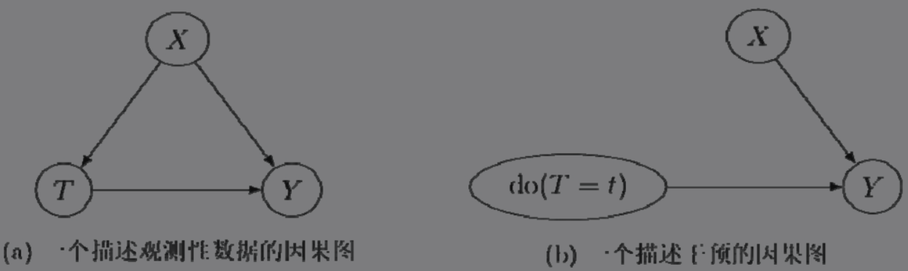
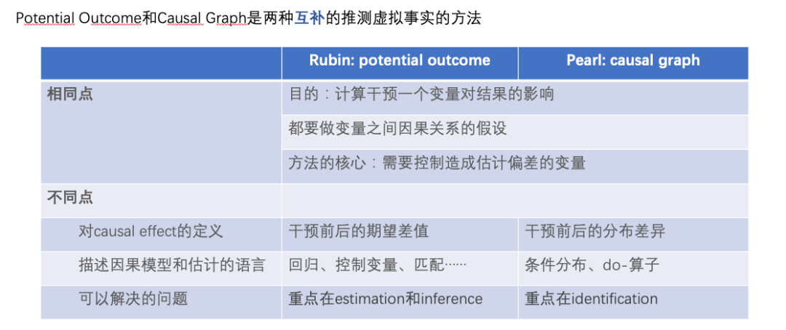

#  Intelligent marketing

智能营销的团队工作会更偏向于主动发起活动或者一种手段，来帮助进行达到团队的目标预期，包括收入，留存等。常规的数据科学的工作更倾向于预测性质，比如用户流失问题上，会去预测哪些用户会流失，而intelligent marketing 的部门会去预测如何去最好的留下每个用户。

In that way, instead of predicting who is likely to churn and then leaving campaign effectiveness to the marketing department, we can predict how to best retain each individual user.

## 1. Identifiability for Causal inference 

SCM 和POF 的两种模型结构就是类似于现有统计学上的贝叶斯概率模型和频率派的模型， 或者是生成式模型和判别式模型的差异。（个人的理解）

### 1.1 SCM 

Judea Pearl提出的结构因果模型(Structural Causal Model,SCM)，可以用严谨的数学符号来表示随机变量之间的因果关系。结构因果模型可以详细地表示出所有观测到的变量之间的因果关系，从而准确地对一个数据集的数据生成过程（DGP）进行描述。有时候我们也可以根据需要把隐变量和相关性考虑进来，表示在结构因果模型中。结构因果模型一般由两部分组成：因果图（causal graph或causal diagram）和结构方程组(structural equation)

**因果图**

一个因果图G=(V,E)是一个有向无环图，它描述了随机变量之间的因果关系，V和E分别是结点和边的集合。在一个因果图中，每个结点表示一个随机变量，无论它是否是被观察到的变量。一条有向边X→Y，则表示X是Y的因，或者说存在X对Y的因果效应。我们可以把因果图看成一种特殊的贝叶斯网络(Bayesian networks)

**有三种基础的因果图结构**

**两种干预干预的常见的因果图**

#### 1.1.1 DGP

​	结构方程组的概念特别重要，对应DGP（date generating process)的概念， 每个因果图都对应一个结构方程组。而结构方程组中的每个方程都用来描述一个随机变量是如何由其父变量和对应的噪声项生成的。在等式的左边是被生成的随机变量，在右边则是显示其生成过程的函数。

以图1.4(a)为例，可以写出所示的结构方程组：
$$
\begin{aligned}
X &= f_X(\epsilon_x) \\
Z &= f_Z(X, \epsilon_x) \\
Y &= f_Y(X,T, \epsilon_x) \\
\end{aligned}
$$
以图1.4(b)为例，可以写出另外一种结构方程组
$$
\begin{aligned}
X &= f_X(\epsilon_x) \\
T &= t \\
Y &= f_Y(X,T, \epsilon_x) \\
\end{aligned}
$$

#### 1.1.2 Confoundedness

在因果推断中，如果在研究X对Y的因果效应，则X是处理变量，Y是结果变量的情况下，我们会把Z这种同时影响处理变量和结果变量（X和Y）的变量称为混淆变量（confounders或者confounding variable)

**因果识别 和后门准则**

我们说一个因果效应被因果识别了，当且仅当定义该因果效应所用到的所有因果量都可以用观测到的变量的统计量的函数来表示

由于SCM 是考虑整个模型的生产结构，并描述各个变量之间的相互影响的精确关系。 其中图结构包括了混杂变量，通过后门准则能进行因果识别。

在实际应用中，我们不一定能够直接具备定义因果图的信息，因此如何学习变量间的因果图结构反而成为了重要的问题。在解决这类问题时，首先我们要明确所需的假设：

**Causal Markov因果马尔可夫假设：**该假设意味任何节点的条件分布仅基于其直接父节点。

**Causal Sufficiency 因果充分性假设：**该假设等同于不存在无法观测的混淆变量。

**Causal Faithfulness 因果忠诚性假设：**该假设意味基于一些条件概率分布，一些节点之间是独立的（因此图可以被切割）。

其算法大致分成两类：

详细介绍可以参考Glymour, Zhang and Sprites (2019)和《中国科学:数学》2018年12期的文章《因果推断的统计方法》：

https://cosx.org/2022/10/causality-statistical-method/。

**Constraint-based Algorithms：**基于条件分布独立检验学习出所有满足faithfulness和causal markov假设的因果图，即检验两个节点之间的条件分布是否独立。例如PC算法（Spirtes and Glymour 1991）和IC算法（Verma and Pearl 1990）。

**Score-based Algorithms：**通过最优化定义的某种score来寻找和数据最匹配的图结构。需要定义structural equations和score functions。例如CGNN算法（Goudet et al. 2017）和NOTEARS算法（Zheng et al. 2018）。这里我们着重介绍一下NOTEARS算法。传统的算法是基于在所有节点和节点间可能产生的关系的基础上，在所有可能生成的图中进行搜索，按照某个标准选出最优解决，这是典型的NP-hard的问题，耗时极长且目前的计算资源基本无法满足运算需求。NOTEARS算法将离散搜索的问题转化成了连续搜索的问题。该算法极大提高了运算速度，使得普通的数据分析师也可以使用。但这个方法也存在着一定的局限性，例如假设所有变量的噪声必须是高斯分布，近年来也有越来越多的方法（如He et al.2021）尝试改进这类方法的假设。

### 1.2 POF 

潜在结果框架（Potential Outcome Framework） 又被称为Neyman-Rubin 框架，因为比较简单，所以应用的范围较广。 和SCM 的框架不同， POF的框架首先引入潜在结果的定义，然后引入三个潜在结果可以被识别的条件。

1. **相关的定义**

定义1 Potential Outcome 

个体潜在这种干预下对应的影响， 也就是反事实的影响结果。所以ITE的定义为一个个体两个潜在结果的差。
$$
ITE(i) = Y^1_i - Y^0_i
$$

定义2: 条件因果效应。

由ITE 的定义引入， 表示特征（协变量）的取值为X=x的亚群上的条件因果效应即是ITE在该亚群上的期望	
$$
CATE(x) = E_{i:x_i=x}[ITE(i)] = E[ITE(i)|X =x]
$$
定义3: 平均因果效应

有ITE 的定义引入ATE，同时ATC，和ATT 的概念雷同这个概念
$$
ATE = E[Y^1_i - Y^0_i]
$$

定义4：事实结果和潜在结果关系
$$
Y_i = T Y_i^1 + (1-T) Y_i^0
$$

对于反事实的问题来说，个体一次只能被观测到一个结果，而在ITE中需要有两个潜在结果， 那么事实结果只是一个潜在结果被观测后的结果。因此有了上述的关系。

2. **可识别性的四个假设条件**

条件1：个体稳定性假设（Stable Unit Treatment Value Assumption）

- 明确的处理变量取值(well-defined treatment levels)：对于任何一对单位（个体）i、j，如果Ti=Tj=t，则意味着这两个单位的状态是一模一样的

- 没有干扰(no interference)：一个单位被观测到的潜结果应当不受其他单位的处理变量的取值的影响

条件2：一致性假设（consistency）

个体被观测到的事实结果，就是这个个体在这个干预下对应的潜在结果。

条件3：**潜在变量和干预条件独立**（unconfoundness）

指的是在给定协变量的情况下， T 和Y 之间相互独立， 不存在未观测到的混杂变量。（条件独立性）

$$
Y_i^1,Y_i^0\ \ \  T | X_i
$$
条件4:  重叠性，overlaping

指在产生数据的处理变量分配机制中，任何一个可能的特征的取值既可能被分配到实验组，也可能被分配到对照组。这个X 对应的群体下，我们希望两种干预都存在。这样有了重叠，才能保证在有限样本的情况下，当整体足够大、单位足够多时，对每一个特征的取值x，可以观测到在实验组和对照组中都存在特征取值为x的单位。

**条件3 和条件4 又被称为 *ignorability*** 

3. 浅结果框架下的因果识别

$$
\begin{aligned}
CATE(X) &= E[Y^1 - Y^0|X=x] \\
&= E[Y^1|X=x] - E[Y^0|X=x] \\
&= E[Y^1|X=x,T=1] - E[Y^0|X=x, T=0] \\
&= E[Y|X=x,T=1] - E[Y|X=x, T=0] \\ 
\end{aligned}
$$

第二行是差的均值 = 均值的差

第三行是条件独立，也就是Unconfoundedness

第四行是一致性，潜在结果就是这个干预下的观测结果

#### 1.2.1 SCM VS POF

从实际角度出发，比起需要考虑所有变量间的因果关系的结构因果模型，潜结果模型往往在因果推断问题中用起来更方便。要利用潜结果模型做到因果识别，往往只需要遵循某种范式。比如，利用前面提到的那三个假设就可以做到因果识别

当然，结构因果模型也有它常用的范式，可以解决因果识别问题，比如，后门准则和前门准则。而结构因果模型因为考虑了所有变量之间的因果关系，因此除了可以做因果推断，也常常被用于因果发现(causal discovey)。因果发现的目的是从数据中学习因果图。

利用结构因果模型下的后门准则或者潜结果模型中的三个基本假设，通过一些推导就可以做到对ATE和CATE的因果识别。我们知道，无论是后门准则还是潜结果框架下的强可忽略性，都依赖于不存在没有观测到的混淆变量这一点。而这一点可能在现实世界的数据集中很难被满足。 在出现混淆变量的情况下，可以采用工具变量的方法， 这时候就需要结合SCM 中的一些想法进行， 但是最后做法上可以没那么复杂。

